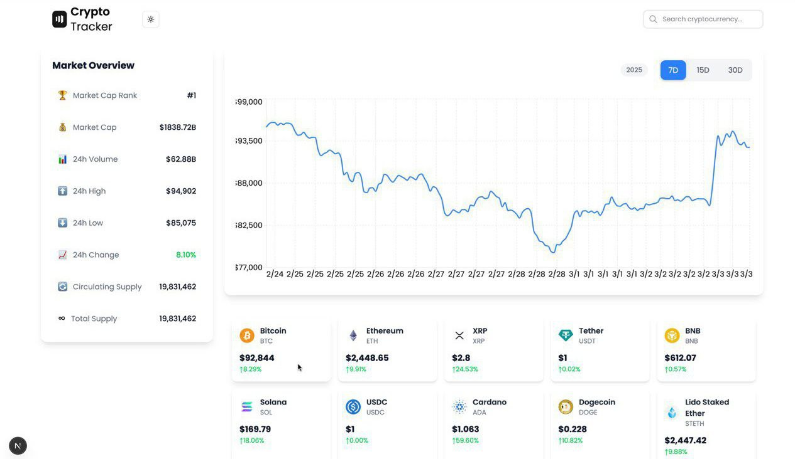

# Crypto Tracker Documentation



## Project Setup Guide

### Web Application Setup

1. **Prerequisites**

   - Node.js (v14 or higher)
   - npm or yarn
   - Git

2. **Installation Steps**

   ```bash
   # Clone the repository
   git clone <repository-url>
   cd cryptotracker

   # Install web app dependencies
   cd web-app
   npm install

   # Start development server
   npm run dev
   ```

   The web application will be available at `http://localhost:3000`

### Environment Setup

Create a `.env.local` file in the web-app directory:

```env
NEXT_PUBLIC_API_URL=https://api.coingecko.com/api/v3
```

## API Integration

### CoinGecko API Integration

We use the CoinGecko API for real-time cryptocurrency data. Here are the main endpoints and their implementations:

1. **Cryptocurrency Search**

```typescript
// Endpoint: /search
// Used in: SearchBar.tsx
const searchEndpoint = `${process.env.NEXT_PUBLIC_API_URL}/search?query=${query}`;
```

- Provides real-time search functionality
- Returns cryptocurrency details including name, symbol, and thumbnail
- Implements 300ms debouncing to prevent rate limiting

2. **Price Chart Data**

```typescript
// Endpoint: /coins/{id}/market_chart
// Used in: CryptoChart.tsx
const chartEndpoint = `${process.env.NEXT_PUBLIC_API_URL}/coins/${cryptoId}/market_chart`;
```

- Fetches historical price data
- Supports multiple time ranges (7D, 15D, 30D)
- Data is transformed for chart visualization

3. **Market Overview**

```typescript
// Endpoint: /coins/{id}
// Used in: MarketOverview.tsx
const marketDataEndpoint = `${process.env.NEXT_PUBLIC_API_URL}/coins/${cryptoId}`;
```

- Retrieves comprehensive market data
- Includes market cap, volume, and price changes
- Auto-updates when cryptocurrency selection changes

### Data Flow Architecture

1. **Data Fetching Strategy**

   - Implemented with native `fetch` API
   - Error handling with try-catch blocks
   - Loading states for better UX
   - Data transformation before state updates

2. **Real-time Updates**
   - Search results update as user types
   - Chart data refreshes on time range change
   - Market overview updates on cryptocurrency selection

## State Management

We chose to use React's built-in state management solutions for several reasons:

### 1. Built-in React State (useState)

```typescript
const [selectedCrypto, setSelectedCrypto] = useState("bitcoin");
const [chartData, setChartData] = useState<ChartDataPoint[]>([]);
```

- Used for component-level state
- Perfect for UI states and temporary data
- Simple and efficient for our use case

### 2. Context API (useTheme)

```typescript
const { theme } = useTheme();
```

- Manages application-wide theme state
- Provides dark/light mode functionality
- Avoids prop drilling for theme values

### Why Not Other Solutions?

1. **Why Not Redux?**

   - Application scale doesn't justify the overhead
   - No complex state interactions
   - No need for middleware or dev tools

2. **Why Not React Query?**

   - Simple API calls don't require advanced caching
   - No real-time synchronization requirements
   - Built-in fetch with useEffect is sufficient

3. **Why Not Zustand?**
   - State structure is straightforward
   - No need for complex state updates
   - Native React state is more maintainable

## Challenges & Solutions

### 1. API Rate Limiting

**Challenge**: Frequent API calls during search causing rate limits.
**Solution**:

```typescript
const [debouncedQuery] = useDebounce(query, 300);
```

- Implemented debouncing for search
- Cached frequently accessed data
- Limited API calls to necessary updates

### 2. Chart Data Processing

**Challenge**: Raw timestamp data not suitable for chart library.
**Solution**:

```typescript
const formattedData = data.prices.map(([timestamp, price]) => ({
  date: new Date(timestamp).toLocaleDateString(),
  price: price,
}));
```

- Created data transformation utilities
- Implemented proper date formatting
- Optimized for chart performance

### 3. Responsive Design

**Challenge**: Complex layouts breaking on mobile devices.
**Solution**:

```typescript
<div className="grid grid-cols-1 lg:grid-cols-4 gap-6">
  <div className="lg:col-span-1">
    <MarketOverview />
  </div>
  <div className="lg:col-span-3">
    <CryptoChart />
  </div>
</div>
```

- Utilized Tailwind CSS grid system
- Implemented responsive breakpoints
- Created mobile-first layouts

### 4. Dark Mode Implementation

**Challenge**: Consistent theming across components.
**Solution**:

```typescript
<div className={`bg-white dark:bg-gray-800 ${theme}`}>
```

- Used next-themes package
- Implemented systematic color schemes
- Created consistent component theming

## Future Improvements

1. **Performance Optimizations**

   - Implement React Query for better caching
   - Add service worker for offline support
   - Optimize bundle size

2. **Feature Additions**

   - Portfolio tracking functionality
   - Price alerts system
   - Additional chart types
   - More time range options

3. **User Experience**
   - Add keyboard navigation
   - Implement better error handling
   - Add loading skeletons
   - Improve accessibility
